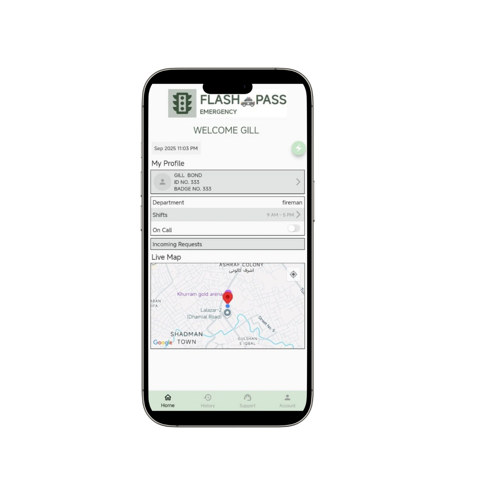
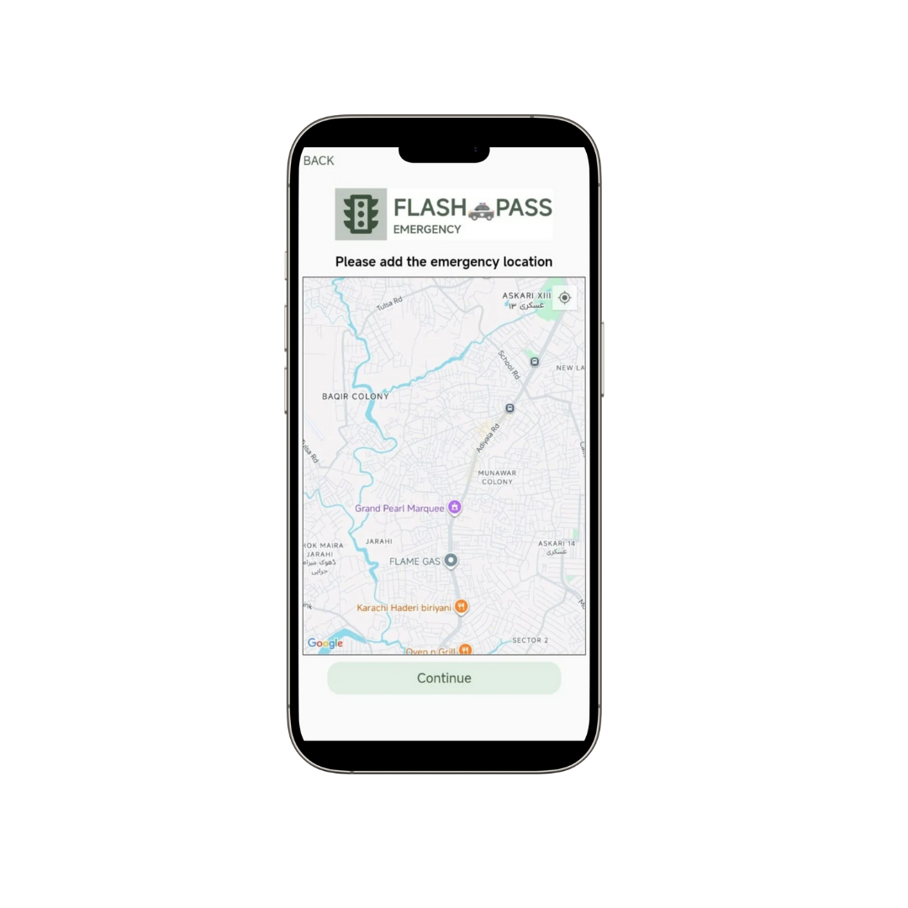

# 🚦 Flash Pass

**Flash Pass** is an emergency traffic management app built with **Flutter**.  
It helps ambulances, police vehicles, and other emergency responders automatically request nearby traffic signals to turn green, ensuring faster response times during emergencies.

---

## ✨ Features

- 🔑 **Authentication**

  - Sign In / Sign Up (step-based signup flow)
  - Forgot & Reset Password

- 🚑 **Emergency Request System**

  - Request to open the nearest traffic light through the map
  - Supports ambulance and police emergency scenarios
  - Real-time signal control for faster clearance

- 🗺 **Traffic Light Control**

  - Detects upcoming signals via map
  - Automatically sends request if an emergency is declared

- 📊 **User Dashboard**

  - Permit management
  - Request history
  - User details screen

- 🎨 **UI/UX**
  - Splash screen & onboarding pages
  - Support & help section
  - Success confirmation screens

---

## 📂 Project Structure

lib/
│-- accountsSc.dart # User account screen
│-- customtabs.dart # Custom navigation tabs
│-- dashSc.dart # Dashboard
│-- deptType.dart # Department type selector
│-- forgetPass.dart # Forgot password
│-- getPermitScreen.dart # Permit request
│-- historySc.dart # Request history
│-- homeSc.dart # Home screen
│-- loginOrSignUp.dart # Login or sign up choice
│-- loginSc.dart # Login screen
│-- main.dart # App entry point
│-- openTrLight.dart # Open traffic light request
│-- reqRecSc.dart # Request received confirmation
│-- resetPass2.dart # Reset password step 2
│-- resetPassSc.dart # Reset password
│-- scheduleSc.dart # Schedule request
│-- signUpSc1-5.dart # Step-based sign up screens
│-- splash.dart # Splash screen
│-- succRegistered.dart # Registration success
│-- supportSc.dart # Support/help
│-- trafficLightCont.dart # Traffic light control logic
│-- userDetailsSc.dart # User details
│-- vpage1.dart # Onboarding page 1
│-- vpage2.dart # Onboarding page 2
│-- vpage3.dart # Onboarding page 3
│-- vpage4.dart # Onboarding page 4

---

## 📱 App Screenshots

### 🚦Main Screen


### 🚦Employee Sign Up & Login Screen


### 🚦Get Going with ID – This screen displays the employee's unique identification card within the Flash Pass app. The digital ID includes the employee's name, photo, role, and a QR code or barcode for quick verification at checkpoints.Employees can use this digital ID for secure access to restricted areas, attendance tracking, and emergency response validation. The design ensures easy scanning and clear visibility for both employees and security personnel.


### 🚦Set Strong Password for better Security. This screen prompts users to create a secure password to protect their account and sensitive emergency management data. Password strength indicators and helpful tips guide users to choose a combination of letters, numbers, and special characters for maximum security.


### 🚦Login Screen – Securely access the Flash Pass app using your credentials. This screen ensures only authorized personnel can log in, protecting sensitive emergency management features and data. Includes options for password recovery and multi-factor authentication for enhanced security.


### 🚦Employee Add Details – Enter and update personal and professional information required for the Flash Pass system. This screen allows employees to provide details such as name, contact information, role, and identification documents. Accurate details help ensure secure access, proper role assignment, and efficient emergency response coordination within the app.


### 🚦Employee Dashboard – Access all key features and information in one place. The dashboard provides a quick overview of current tasks, emergency requests, shift schedules, and notifications. Employees can easily navigate to different modules, monitor real-time updates, and manage their responsibilities efficiently from this central hub.



### 🚦Select your Emergency – Choose the type of emergency situation (such as ambulance, police, or fire) to initiate the appropriate response workflow. This screen ensures that the correct emergency services are notified and that the app tailors its features to the specific needs of the situation. Additional guidance and quick tips may be provided to help users make the right selection quickly and efficiently.


### 🚦Visitor Detail Screen – View and manage information about visitors in the Flash Pass system. This screen displays visitor names, contact details, visit purpose, and entry/exit times. It helps ensure secure and organized tracking of all visitors, supporting both safety and compliance requirements. Additional features may include visitor approval workflows, badge assignment, and real-time notifications for new arrivals.


### 🚦Employee Add the Phone Number for verification. This step ensures the employee's identity and enables secure access to the Flash Pass system. After entering the phone number, a verification code will be sent for authentication.


### 🚦Location – Employees can set or update their current location for emergency response coordination. This ensures accurate routing and faster assistance during critical situations.



### 🚦Map – Visualize real-time locations of emergency vehicles and traffic signals. The interactive map helps coordinate routes and monitor emergency response progress for faster and safer navigation.


### 🚦 Sent Request – After selecting the emergency type and confirming details, the app sends a real-time request to the traffic management system. This request triggers the process to turn nearby traffic signals green, ensuring a clear path for emergency vehicles. The screen provides confirmation and status updates so users know their request is being processed.


### 🚦 Received Request – Once the emergency request is sent, this screen confirms that the traffic management system has received it. The app displays the request status, estimated response time, and any additional instructions for the emergency vehicle. This ensures users are informed and can track the progress of their request in real time.


### 🚦Coming Alert – This screen notifies users of an incoming emergency request or alert. It provides real-time updates about the status of the emergency, ensuring that all relevant personnel are informed and can respond promptly. The alert includes details such as the type of emergency, location, and any special instructions for immediate action.


### 🚦Traffic Light Control – This screen allows authorized personnel to manually control traffic lights in response to emergency situations. Users can override normal traffic signal patterns to turn lights green for emergency vehicles, ensuring a clear and safe passage through intersections. The interface provides real-time feedback on the status of each traffic light being controlled.


### 🚦Support – Access help and support resources for using the Flash Pass app. This screen provides FAQs, contact information for customer service, and troubleshooting tips to assist users with any issues they may encounter while using the app. It ensures that users have the necessary support to effectively utilize the emergency traffic management features.


### 🚦 History – View a detailed log of all emergency requests, actions taken, and traffic light changes. This screen provides a chronological record for auditing and reviewing past events, helping improve response strategies and accountability. Easily filter and search through previous incidents for quick reference.


### 🚦 Profile & Settings – Manage your account information, preferences, and app settings. This screen allows users to update personal details, change passwords, configure notification preferences, and customize app features to suit their needs. It ensures a personalized experience while maintaining security and accessibility.


### 🚦 Employee Details – View and manage detailed information about employees registered in the Flash Pass system. This screen provides access to employee profiles, roles, and contact information, allowing for efficient management and communication within the emergency response team.


### 🚦 Employee Shift Management – Schedule and track employee shifts for optimal coverage during emergency situations. This screen allows managers to assign shifts, view availability, and ensure that the right personnel are on duty when needed. It helps maintain an organized and efficient response team.


### 🚦Feedback – Provide feedback on the app experience and report any issues. This screen allows users to submit comments, suggestions, and bug reports directly to the development team, helping to improve the app's functionality and user satisfaction over time.


---

## 🚀 Getting Started

### Prerequisites

- [Flutter SDK](https://flutter.dev/docs/get-started/install)
- Dart >= 3.x
- Android Studio / VS Code with Flutter plugin
- Firebase or REST API for authentication & traffic signal control

### Installation

### Option 1: Install from GitHub Releases

1. Go to the **[Releases Section](https://github.com/ravDev-darting/flash-pass-app/releases/download/v1.0.0/app-release.apk)**.
2. Download the latest file:
   - For Android devices → `app-release.apk`
   - For Play Store upload → `app-release.aab`
3. Install on your device.
   > ⚠️ You may see a warning like _"This file may be harmful"_ — this happens because the app is not from Google Play. You can safely proceed if you trust the source.

### Option 2: Build from Source

1. Clone the repository:

```bash
   git clone https://github.com/ravDev-darting/flash-pass-app

# Go to project folder

cd flash-pass

# Install dependencies

flutter pub get

# Run on device

flutter run
```
