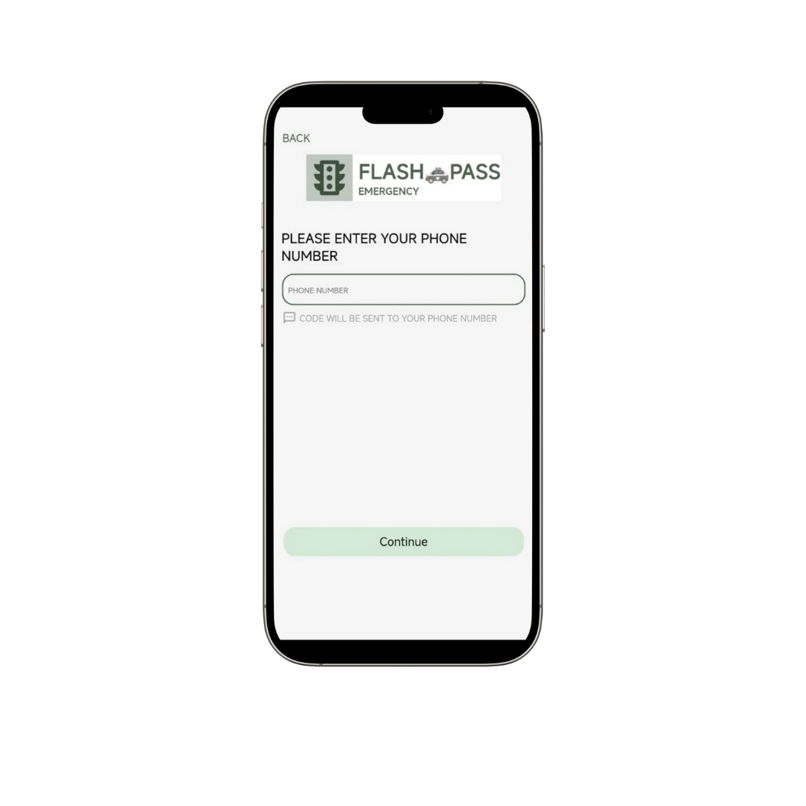
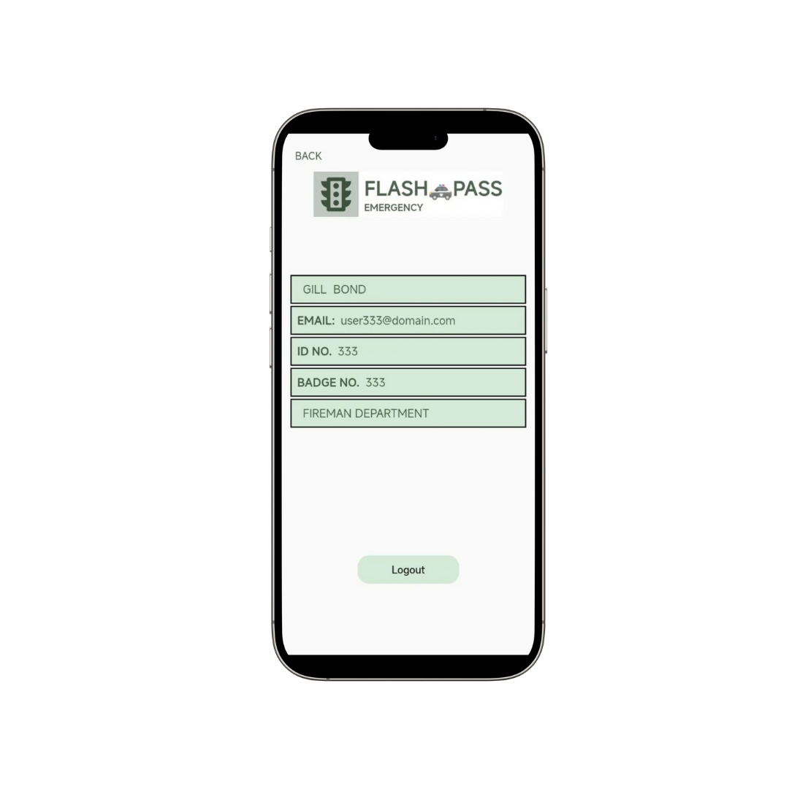

# 🚦 Flash Pass

**Flash Pass** is an emergency traffic management app built with **Flutter**.  
It helps ambulances, police vehicles, and other emergency responders automatically request nearby traffic signals to turn green, ensuring faster response times during emergencies.

---

## ✨ Features

- 🔑 **Authentication**

  - Sign In / Sign Up (step-based signup flow)
  - Forgot & Reset Password

- 🚑 **Emergency Request System**

  - Request to open the nearest traffic light through the map
  - Supports ambulance and police emergency scenarios
  - Real-time signal control for faster clearance

- 🗺 **Traffic Light Control**

  - Detects upcoming signals via map
  - Automatically sends request if an emergency is declared

- 📊 **User Dashboard**

  - Permit management
  - Request history
  - User details screen

- 🎨 **UI/UX**
  - Splash screen & onboarding pages
  - Support & help section
  - Success confirmation screens

---

## 📂 Project Structure

lib/
│-- accountsSc.dart # User account screen
│-- customtabs.dart # Custom navigation tabs
│-- dashSc.dart # Dashboard
│-- deptType.dart # Department type selector
│-- forgetPass.dart # Forgot password
│-- getPermitScreen.dart # Permit request
│-- historySc.dart # Request history
│-- homeSc.dart # Home screen
│-- loginOrSignUp.dart # Login or sign up choice
│-- loginSc.dart # Login screen
│-- main.dart # App entry point
│-- openTrLight.dart # Open traffic light request
│-- reqRecSc.dart # Request received confirmation
│-- resetPass2.dart # Reset password step 2
│-- resetPassSc.dart # Reset password
│-- scheduleSc.dart # Schedule request
│-- signUpSc1-5.dart # Step-based sign up screens
│-- splash.dart # Splash screen
│-- succRegistered.dart # Registration success
│-- supportSc.dart # Support/help
│-- trafficLightCont.dart # Traffic light control logic
│-- userDetailsSc.dart # User details
│-- vpage1.dart # Onboarding page 1
│-- vpage2.dart # Onboarding page 2
│-- vpage3.dart # Onboarding page 3
│-- vpage4.dart # Onboarding page 4

---

## 📱 App Screenshots

### 🚦main_screen


### 🚦empolyer_sign_up_login.png


### 🚦employe_id


### 🚦set_password


### 🚦login


### 🚦employe_add_details


### 🚦employe_dashboard


### 🚦emergency


### 🚦visitor_detail


### 🚦mploye_phone_number



### 🚦location


### 🚦map


### 🚦send \_request


### 🚦recevied_request


### 🚦coming_alert


### 🚦traffic_light


### 🚦support


### 🚦history


### 🚦profile_setting


### 🚦empolyee_detail



### 🚦employee_shift


### 🚦feedback


---

## 🚀 Getting Started

### Prerequisites

- [Flutter SDK](https://flutter.dev/docs/get-started/install)
- Dart >= 3.x
- Android Studio / VS Code with Flutter plugin
- Firebase or REST API for authentication & traffic signal control

### Installation

### Option 1: Install from GitHub Releases

1. Go to the **[Releases Section](https://github.com/ravDev-darting/flash-pass-app/releases/download/v1.0.0/app-release.apk)**.
2. Download the latest file:
   - For Android devices → `app-release.apk`
   - For Play Store upload → `app-release.aab`
3. Install on your device.
   > ⚠️ You may see a warning like _"This file may be harmful"_ — this happens because the app is not from Google Play. You can safely proceed if you trust the source.

### Option 2: Build from Source

1. Clone the repository:

```bash
   git clone https://github.com/ravDev-darting/flash-pass-app

# Go to project folder

cd flash-pass

# Install dependencies

flutter pub get

# Run on device

flutter run
```
